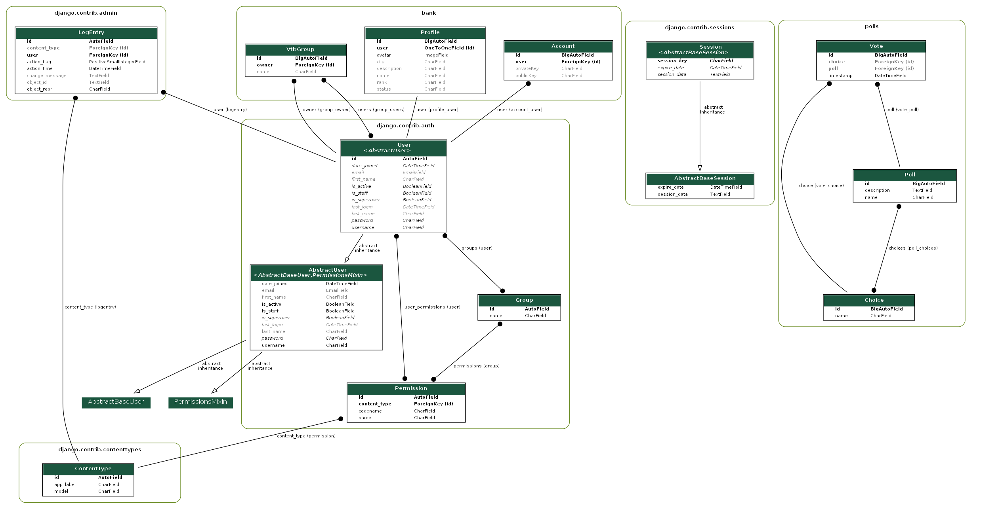

# О проекте vtv-hack
https://moretech.vtb.ru/

Хакатон MORE.teach 4.0 

Команда "Win+ners"

Даты 07.10.22 - 07.10.22

Трек - Web

Задача - Разработать веб-сервис с элементами геймификации для вовлечения сотрудников Банка ВТБ во внутрикорпоративные активности

## Инструменты
- python 3.8
- django 4
- PostgreSQL
- Docker
- Bootstrap 5

## Что реализовано
- регистрация
- добавление в группы
- получение/ перевод/ генерация через внешнюю API коинов
- лидерборд
- опросник
- профиль пользователя и его редактирование
- рукописная админка (считай страничка)

## Что не реализованно
- магазин
- группы сделаны не django-groups а просто табличкой
- мобильная версия

# Запуск через Docker (VPS in https://cloud.yandex.ru/)

## 1. Установка Docker (Ubuntu 20.04) 
https://www.digitalocean.com/community/tutorials/how-to-install-and-use-docker-on-ubuntu-20-04-ru

    sudo apt update
    sudo apt install apt-transport-https ca-certificates curl software-properties-common
    curl -fsSL https://download.docker.com/linux/ubuntu/gpg | sudo apt-key add -
    sudo add-apt-repository "deb [arch=amd64] https://download.docker.com/linux/ubuntu focal stable"
    sudo apt update
    apt-cache policy docker-ce
    sudo apt install docker-ce
    sudo systemctl status docker // status

## 2. Установка Docker-compose (Ubuntu 20.04)
https://www.digitalocean.com/community/tutorials/how-to-install-and-use-docker-compose-on-ubuntu-20-04-ru

    sudo curl -L "https://github.com/docker/compose/releases/download/1.26.0/docker-compose-$(uname -s)-$(uname -m)" -o /usr/local/bin/docker-compose
    sudo chmod +x /usr/local/bin/docker-compose
    docker-compose --version // status

## 3. Запуск через Docker-compose
https://webdevblog.ru/kak-ispolzovat-django-postgresql-i-docker/

    sudo git clone https://github.com/bd240897/vtb-hack.git
    cd ./vtb-hack/

    // запуск dev-server+SQLite (Debug=True, hosts="*")
    sudo docker-compose up -d

    // запуск unicorn+Postgres (Debug=True, hosts="*")
    sudo docker-compose -f docker-compose.test.yml up --build -d

    // запуск nginx+unicorn+Postgres (Debug=False, hosts="one")
    sudo docker-compose -f docker-compose.perprod.yml up --build -d

# Запуск на Windows
    git clone https://github.com/bd240897/vtb-hack.git
    python -m venv venv
    venv\Scripts\activate.bat
    cd vtb-hack\lms
    pip install -r req.txt
    python manage.py migrate
    python manage.py makemigrations bank
    python manage.py migrate
    python manage.py collectstatic
    python manage.py createsuperuser
    python manage.py runserver

# Материалы проекта 

## Верстка проекта в figma
    https://www.figma.com/file/TgSW8pv0zzggm4yk43SHhd/ВТБ?node-id=0%3A1

## Доска с идеями на миро
    https://miro.com/app/board/uXjVPP7sbA0=/?share_link_id=9790951654700

# МОИ ЗАМЕТКИ

    sudo -i // войти под админа
    password // сменить пароль админу

    указать DJANGO_SETTINGS_MODULE в env чтоб сменить настрокий (указать тольк в wsgi недостаточно!!!!)
    
    чтоб удалить volumes (одного недостаточно)
    sudo docker system prune
    sudo docker volume prune

    запуск докера в фоне с указанием файла
    sudo docker-compose -f docker-compose.test.yml up --build -d

    клонировать конкретную ветку git
    sudo git clone https://github.com/bd240897/vtb-hack.git --branch develop

### очистить БД
    python manage.py migrate <app> zero

### установка django-extension
    https://www.youtube.com/watch?v=8z3osE4aJ0I
    https://django-extensions.readthedocs.io/en/latest/graph_models.html
    https://github.com/django-extensions/django-extensions
    https://simpleit.rocks/python/django/generate-uml-class-diagrams-from-django-models/
    pip install django-extensions
    pip install pyparsing
    pip install graphviz

    pip install pydot
    conda install graphviz // another way https://graphviz.org/download/
    
    add to path C:\Games\Graphviz\bin and C:\Games\Graphviz\bin\dot.exe (панель управления - система - параметры ситемы)
    // нужно будет перезагрзить комп!
    
    INSTALLED_APPS = (
        ...
        'django_extensions',
        ...
    )
    
    // команды
    python manage.py graph_models -a -g -o lms.png
    python manage.py show_urls
    python manage.py validate_templates
    python manage.py shell_plus
    python manage.py runserver_plus

### Удаленная БД
    https://habr.com/ru/post/578744/

### load data
    // by commands or setup()
    https://stackoverflow.com/questions/41518910/how-to-make-a-script-to-insert-data-in-my-default-sqlite3-database-django
    // by dump data
    https://the-bosha.ru/2016/06/29/django-delaem-damp-bazy-dannykh-i-vosstanavlivaem-iz-nego-s-dumpdata-i-loaddata/

### Настройка админки
    // django-school (django_movie)
    https://www.youtube.com/watch?v=SZ-kPr4Z38A
    https://www.youtube.com/watch?v=SZ-kPr4Z38A&list=PLF-NY6ldwAWrb6nQcPL21XX_-AmivFAYq&index=13
    https://www.youtube.com/watch?v=iKqzyxVWuPU&list=PLF-NY6ldwAWrb6nQcPL21XX_-AmivFAYq&index=14
    https://www.youtube.com/watch?v=iKqzyxVWuPU&list=PLF-NY6ldwAWrb6nQcPL21XX_-AmivFAYq&index=15
    https://www.youtube.com/watch?v=YsAhxkSGJyg&list=PLF-NY6ldwAWrb6nQcPL21XX_-AmivFAYq&index=16
    https://github.com/DJWOMS/django_movie/tree/2ee88bc34eb1ecf372d5d92e05261cecacb2e377
    //selfedu
    https://www.youtube.com/watch?v=6jyl85q6yRs&list=PLA0M1Bcd0w8xO_39zZll2u1lz_Q-Mwn1F&index=24
    https://github.com/selfedu-rus/django-lessons

### generate key with comment
    https://www.youtube.com/watch?v=wDcjM7BySo0&t=5s
    https://stackoverflow.com/questions/31813080/generate-new-ssh-keys-in-windows-10-11
    ssh-keygen -t rsa -C "your email here" -f dima

### Литература

    // книги
    https://www.rulit.me/data/programs/resources/pdf/Django-3-By-Example_RuLit_Me_607171.pdf
    https://codernet.ru/tem/static/pdfjs/web/viewer.html?file=/media/Django%202%20в%20примерах.%20А.Меле/django_2_v_primerax_a_mele.pdf
    https://pocoz.gitbooks.io/django-v-primerah/content/glava-8-upravlenie-platezhami-i-zakazami.html
    https://github.com/PacktPublishing/Django-2-by-Example
    // курсы
    https://proproprogs.ru/django/dobavlyaem-slagi-slug-k-url-adresam
    https://www.youtube.com/watch?v=HQB6dYOeo3M
    // streamlit
    https://www.youtube.com/watch?v=8M20LyCZDOY&list=PLtqF5YXg7GLmCvTswG32NqQypOuYkPRUE&index=3
    https://www.youtube.com/watch?v=YClmpnpszq8
    https://docs.streamlit.io/
    https://habr.com/ru/post/568836/
    https://habr.com/ru/post/473196/
    https://habr.com/ru/company/ruvds/blog/556158/
    https://habr.com/ru/company/skillfactory/blog/509340/
    https://medium.com/nuances-of-programming/streamlit-для-создания-интерактивных-веб-приложений-начало-9e6961877dc9
    https://proglib.io/p/sozdanie-interaktivnyh-paneley-s-streamlit-i-python-2021-06-21
    // получение размера экрана
    https://habr.com/ru/post/509258/
    // css media запросы
    https://habr.com/ru/post/475832/

### Схема моей БД

### BLOG VUE + DJANGO start find info
//

https://django.fun/ru/articles/tutorials/registraciya-i-avtorizaciya-polzovatelej-v-django-s-pomoshyu-djoser-i-veb-tokenov-json/
    
//

https://github.com/Alexmhack/django_chat
    
//

https://webdevblog.ru/django-vue-js-i-graphql/
    
//

https://github.com/fussionlab/VueJs-Django
    
//

https://habr.com/ru/post/492486/
    
//

https://habr.com/ru/company/otus/blog/500884/

### То что уже посмотрел (references)
////// DjangoSchool //////
https://www.youtube.com/c/DjangoSchool

// vue-movie - курс по vue?
https://github.com/DJWOMS/vue-movie

// djangochannel - что это? он писал сайт для себя?
https://github.com/DJWOMS/djangochannel

// cook_blog - блог шеф повара
https://www.youtube.com/watch?v=f7zwXjPJRtU&list=PLF-NY6ldwAWpK1DDLdRcmRRX4_WtOa-Bo
https://github.com/DJWOMS/cook_blog

// django_movie_drf - видимо продолжение джанго муви но с drf
https://www.youtube.com/watch?v=svx8GlynIAI&list=PLF-NY6ldwAWqSxUpnTBObEP21cFQxNJ7C&index=17
https://github.com/DJWOMS/django_movie_drf

// django_movie - это тип его курс по джанге
https://www.youtube.com/watch?v=kBNUGLVJoOo&list=PLF-NY6ldwAWrb6nQcPL21XX_-AmivFAYq&index=29
https://github.com/DJWOMS/django_movie

// чат на vue + drf (jquery) - это его 0-й курс!!!!
https://www.youtube.com/watch?v=y_As6ZLFWPg&list=PLF-NY6ldwAWqP9PqPU3LA7mX2KJVyLhC_&index=13
https://github.com/DJWOMS/WomsChat2

// чат на vue + drf + socket (fetch)
https://www.youtube.com/watch?v=hpMnjxyegDM&t=1s
https://github.com/DJWOMS/DjangoWebSocketChatBackEnd
https://github.com/DJWOMS/WomsWebSocketChat

// диплой django+vue (не тот что в курсе 0) - в каком то стриме мб?

// курс по vue

////// STEPIC //////

// SPA сайт на Django Rest Framework и NuxtJS
https://stepik.org/course/82067/syllabus

////// ANOTHER ////////

// vue + docker
https://ru.vuejs.org/v2/cookbook/dockerize-vuejs-app.html
// vue documentations
https://ru.vuejs.org/v2/guide/

//////// Я РЕШАЛ //////////////////

// django by example (unit 4)
https://github.com/bd240897/Django-2-by-Example_part_2

[my github list](./README/my_git.md)